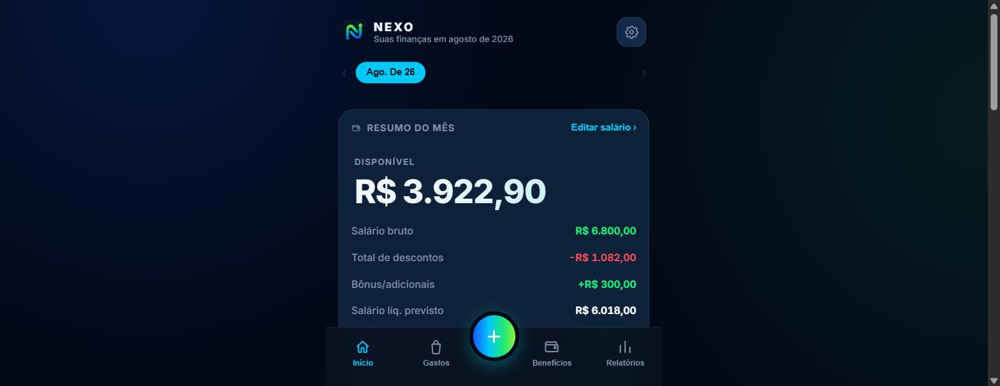
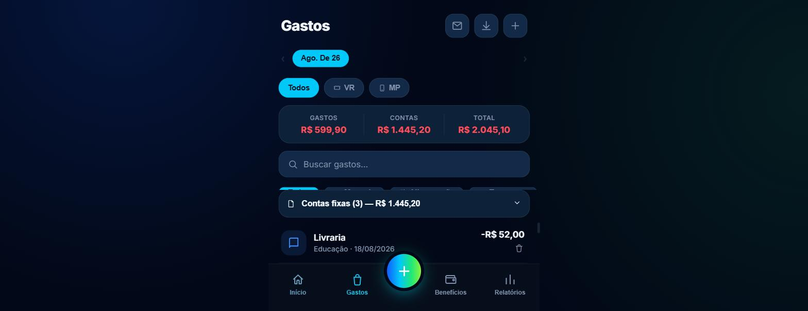
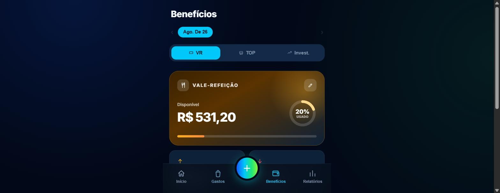
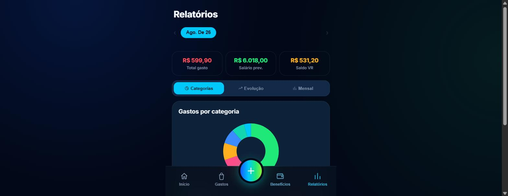

# Nexo — Finanças Pessoais

App de controle financeiro pessoal, focado no dia a dia de quem recebe salário CLT com benefícios (Vale Refeição, Cartão Transporte) e quer entender exatamente para onde o dinheiro vai — sem depender de planilha.

**Demo online:** https://financas-apps.pages.dev/

## Screenshots

| Início | Gastos |
|---|---|
|  |  |

| Benefícios (VR) | Relatórios |
|---|---|
|  |  |

> Os valores exibidos nos prints são fictícios, gerados apenas para demonstração.

## Funcionalidades

- **Controle de gastos** por categoria e forma de pagamento (dinheiro, débito, crédito, PIX, VR, Cartão TOP), com busca, filtros e histórico ordenado por data.
- **Calculadora de salário líquido** com INSS, IRRF, descontos, faltas (com cálculo automático de DSR) e bônus.
- **Vale Refeição (VR)**: saldo com carry-over entre meses, histórico de recargas e gastos.
- **Cartão TOP (transporte)**: saldo, recargas e gastos vinculados.
- **Investimentos**: aportes e rendimentos, com projeção de rentabilidade baseada em % do CDI.
- **Contas fixas / recorrentes**: templates de contas do mês com status de pago/pendente.
- **Relatórios**: gráficos de gastos por categoria, evolução mensal e comparativo entre meses.
- **Importação de transações**:
  - via JSON colado manualmente;
  - via leitura de e-mails do Gmail (detecta avisos de Pix e compras no débito do Mercado Pago e sugere o lançamento, evitando duplicados).
- **Login com Google + sincronização na nuvem** via Firebase/Firestore — os dados ficam disponíveis em qualquer dispositivo.
- **Tema claro/escuro**, PWA-friendly (ícone de app, viewport travado para uso mobile).

## Stack

- **Frontend:** HTML, CSS e JavaScript puros (zero frameworks, zero build step) — um único arquivo (`index.html`), fácil de hospedar em qualquer lugar (Cloudflare Pages, Vercel, Netlify, GitHub Pages).
- **Backend:** Firebase Authentication (Google Sign-In) + Firestore para sincronização de dados entre dispositivos.
- **Integrações:** Gmail API (OAuth via Google Identity Services) para leitura opcional de comprovantes de pagamento.

## Como rodar localmente

Não há dependências nem build. Basta servir a pasta como arquivo estático:

```bash
git clone https://github.com/pedro-bachiegaa/financas-pessoais.git
cd financas-pessoais
npx serve .
```

Para habilitar login com Google e sincronização na nuvem em um ambiente próprio, configure um projeto no [Firebase Console](https://console.firebase.google.com/) e substitua as credenciais em `index.html` (bloco `firebase.initializeApp`) pelas do seu projeto.

## Estrutura

Projeto intencionalmente **single-file**, priorizando simplicidade de deploy e zero dependências — ideal como base para customização rápida (troca de categorias, cores, moeda, regras de cálculo de salário, etc.).

## Licença

Código proprietário — todos os direitos reservados. Veja [LICENSE](LICENSE).
